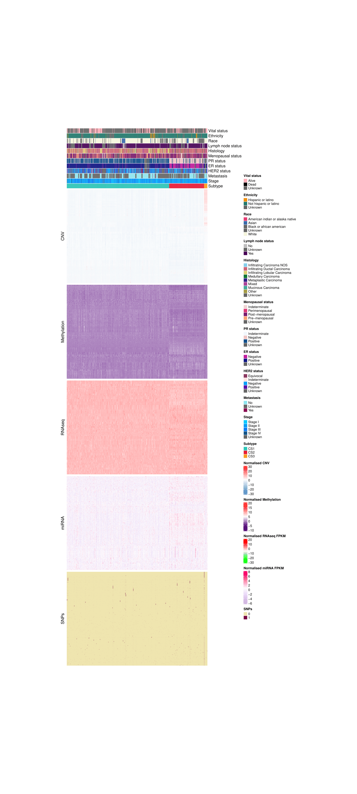

```{r setup, include=FALSE}
knitr::opts_chunk$set(echo = TRUE)
```

# Details on the algorithm
`r params$description`

# Hyperparameters and tuning
```{r, echo=FALSE, results='asis'}
res <- knitr::knit_child(paste0(params$home, "/Resources/algorithm_descriptions/",
                                params$algorithm, "_hyperparameters_text.Rmd"), quiet = TRUE)
cat(res, sep = '\n')
```

# Main results on training data
## Optimal number of clusters
The optimal number of clusters according to MOVICS is $k = `r params[["optk"]]`$.
`)

The multi-omics consensus clustering results for $k = `r params[["optk"]]`$ are shown below (pairwise distances heatmap):
`)

Below are the silhouette metrics for the `r params[["optk"]]` clusters:
`)

Comprehensive multi-omics heatmap and clusters:


## Clinical variables
With respect to <u>clinical variables</u> statistically significant associations were found between the consensus subtypes and <b>race, PR status, ER status, and distant metastasis</b>. Results can be found in the [summary file](`r paste0(params$home,"/Results/MOVICS_baseline/Summary_of_clinical_variables.txt")`).

## Mutations
The MOVICS package provides a function ``compMut()`` which applies independent testing (i.e., Fisher' s exact test or $\chi^2$ test) for each mutation, and generates a table with statistical results and creates an OncoPrint using those differentially mutated genes.

<b>Oncoprint:</b>

`)

## Differential Gene Expression Analysis (DGEA)
DGEA is performed in order to compare the expression of the two identified consensus subtypes using the __DESeq2__ package.

In order to identify subtype-specific markers, we find the markers that are up-regulated in CS1 vs. all other clusters and the ones which are down-regulated in CS1 vs. all other clusters.

In this procedure, the most differentially expressed genes sorted by __log2FoldChange__ are chosen as the biomarkers for each subtype (200 biomarkers for each subtype by default; Here we set 200 -> 100 markers). These biomarkers should pass the significance threshold (e.g., nominal $p-$value < 0.05 and adjusted $p-$value < 0.05) and must not overlap with any biomarkers identified for other subtypes.

No markers are found for CS3.

<b>Up-regulated markers</b>
`)

## Gene Set Enrichment Analysis

GSEA is carried out using a gene set background which includes all gene sets derived from GO biological processes (c5.bp.v7.1.symbols.gmt) from The Molecular Signatures Database (MSigDB, https://www.gsea-msigdb.org/gsea/msigdb/index.jsp).

Likewise, these identified specific pathways should pass the significance threshold (e.g., nominal $p-$value < 0.05 and adjusted $p-$value < 0.25; we set the latter to <u>0.1</u>) and must not overlap with any pathways identified for other subtypes. After having the subtype-specific pathways, genes that are inside the pathways are retrieved to calculate a single sample enrichment score by using ``GSVA`` R package. Subsequently, subtype-specific enrichment score will be represented by the mean or median (mean by default) value within the subtype, and will be further visualized by diagonal heatmap.

`)

For all the new defined molecular subtypes, it is critical to depict its characteristics validated by different signatures of gene sets. MOVICS provides a simple function which uses gene set variation analysis to calculate an enrichment score for each sample in each subtype based on given gene set list of interest.

`)

# Evaluation results
## Nearest Template Prediction (NTP)
MOVICS provides two model-free approaches for subtype prediction in validation cohort. First, MOVICS switches to nearest template prediction ([NTP](https://pubmed.ncbi.nlm.nih.gov/21124904/)) which can be flexibly applied to cross-platform, cross-species, and multiclass predictions without any optimization of analysis parameters.

Here cosine similarity is used to compare external samples to class templates (here we use the up-regulated genes in the form of a binary matrix with two columns: cluster 1 / cluster 2 where an entry is 1 if the gene is up-regulated in the cluster or -1 otherwise). The nearest class for each sample is determined by the smallest distance (converted from cosine similarity here). Each sample's result includes the nearest class prediction, the distance to all templates, and the p-value of the prediction.

The function randomly permutes the sample labels multiple times (here ``nPerm = 10000``) to generate a null distribution of similarity scores between samples and class templates. For each observed sample-to-template distance, the function compares it against the null distribution to calculate a p-value. This p-value indicates the likelihood that the observed match could have occurred by chance. The p-values are adjusted using the false discovery rate (FDR) method to control for multiple hypothesis testing, ensuring robust statistical inference.

`)
`)

Results on the comparisons of transNEO clinical variables with respect to the predicted consensus subtypes are summarised in [this file](`r paste0(params$home,"/Results/MOVICS_baseline/transNEO_Summary_of_clinical_variables.txt")`).

## Partition Around Medoids (PAM)

To be specific, ``runPAM()`` first trains a partition around medoids (PAM) classifier in the discovery (training) cohort (i.e., TCGA) to predict the subtype for patients in the external validation (testing) cohort (i.e., transNEO), and each sample in the validation cohort was assigned to a subtype label whose centroid had the highest Pearson correlation with the sample. Finally, the [in-group proportion (IGP)](https://pubmed.ncbi.nlm.nih.gov/16613834/) statistic (the proportion of samples within a cluster that were classified into the same cluster upon random permutation of the data) is estimated to evaluate the similarity and reproducibility of the acquired subtypes between discovery and validation cohorts (i.e. are the clusters identified in TCGA reproducible in transNEO after label permutation).

Compare consensus TCGA vs. PAM TCGA (other comparisons not possible):
`)

## Clinical variables in transNEO
The predicted CS1 and CS2 subtypes on transNEO are associated with <b>Lymph node status at diagnosis,
ER status, Grade, pCR (more responders in CS2), PAM50, iC10, number of adjuvant HER2 cycles, RCB score, STAT1.gsva score, GGI.gsva score, ESC.gsva score, TMB and HRD.sum</b>.

# Supplementary results

## Drug Sensitivity
We also perform a few drug sensitivity comparisons. MOVICS uses the [pRRophetic]() package for prediction of clinical chemotherapeutic response from tumor gene expression levels (a pre-trained ridge regression model is fit for each gene and the $IC_{50}$ of each drug).

`)
`)
`)
`)
`)
`)

## Subtype agreement
Here we examine how similar the consensus multi-omic clustering labels are to labels from established classification systems like PAM50, tumor staging, iC10 and tumor grade.

MOVICS provides function of ``compAgree()`` to calculate four statistics: Rand Index (RI), Adjusted Mutual Information (AMI), Jaccard Index (JI), and Fowlkes-Mallows (FM); all these measurements range from 0 to 1 and the larger the value is, the more similar the compared groups are. 

`)

# Conclusions

<ol>
  <li>There are `r params$optk` predicted clusters (consensus subtypes) in the `r params$data_source` cohort.</li>
  <li>Special findings about different consensus subtypes:
  <ul>
    <li>CS1 has the majority of ER+ cancers. Almost all ILC are in CS1.</li>
    <li>CS3 has a distinct CNV profile compared to CS1 and CS2.</li>
    <li>CS2 is predicted to be significantly more sensitive to cisplatin compared to CS1 and CS3.</li>
  </ul></li>
  <li>CS1 and CS2 labels in transNEO are associated with clinical variables of interest.</li>
</ol>

# Session info

```{r echo = FALSE}
print(params$sessionInfo)
```